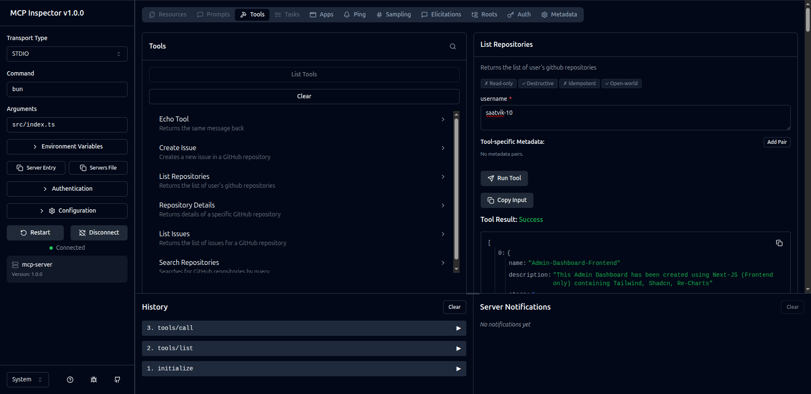

# mcp-server

MCP server with GitHub integration tools for repository and issue management.

## Setup

```bash
bun install
```

Copy `.env.example` to `.env` and set your GitHub token (optional — unauthenticated requests work for public repos):

```env
GITHUB_TOKEN=ghp_xxxxxxxxxxxxxxxx
```

## Usage

```bash
bun run src/index.ts
```

The server runs on stdio — connect it to an MCP client (e.g., MCP Inspector).

## Tools

| Tool | Description |
|---|---|
| `echo` | Returns the same message back |
| `list-repositories` | List GitHub repos for a user |
| `repository-details` | Get details of a specific repo |
| `search-repositories` | Search repos by query |
| `list-issues` | List issues for a repo |
| `create-issue` | Create a new issue |

## Demo


